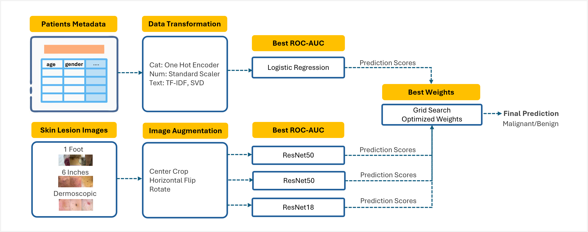

# Multimodal Skin Cancer Detection



## Table of Contents
- [About the Project](#about-the-project)
- [Getting Started](#getting-started)
  - [Prerequisites](#prerequisites)
  - [Environment Setup](#environment-setup)
  - [Data Setup](#data-setup)
- [Project Structure](#project-structure)
- [Methodology](#methodology)
- [Model Results](#model-results)
- [Dataset Access](#data-access)
- [References](#references)
- [License](#license)

## About the Project
This project examines whether AI models can identify skin cancer from different input modalities using the MRA-MIDAS dataset (Chiou et al., 2024). It compares image-only models, metadata-only models, and models that combine clinical and dermoscopic images with clinical metadata to assess differences in performance and reliability. The study also investigates which data sources provide the strongest predictive signal and whether combining inputs offers meaningful improvements.

## Getting Started

### Prerequisites
- Python 3.10 
- `conda`
- `pip`

### Environment Setup

1.  Clone the Repository

    Clone the repository to your desired folder:

    ```bash
    git clone https://github.com/umich-mads-capstone/mra_midas_skin_cancer_ml
    cd mra_midas_skin_cancer_ml
    ```

2.  Create and Activate a Virtual Environment

    Create a conda virtual environment:

    ```bash
    conda create -n skin_cancer python=3.10 pip
    ```

    After creating the virtual environment, activate it using the command below:

    ```bash
    conda activate skin_cancer
    ```

3.  Install Package and Dependencies

    Install this repository as a local package along with its dependencies:

    ```bash
    pip install -e .
    ```

### Data Setup

Download the dataset from the [MRA-MIDAS dataset](https://aimi.stanford.edu/datasets/mra-midas-Multimodal-Image-Dataset-for-AI-based-Skin-Cancer) page. 
You must create an account, accept the Terms and Agreement, and copy the URL provided on the download page. This URL is required to securely download the data using AzCopy. If it expires, request a new one from the dataset page.

1.  Install AzCopy

    Install and set up AzCopy by following the [official guide](https://learn.microsoft.com/en-us/azure/storage/common/storage-use-azcopy-v10). Verify installation:

    ```bash
    azcopy --version
    ```

2.  Download the Dataset

    Run the following command, replacing <URL> with the link you copied:

    ```bash
    azcopy copy "<URL>" "./data/input" --recursive
    ```

3.  Organize Files

    After downloading, move the clinical metadata (`release_midas.xlsx`) out of the downloaded folder and rename the downloaded folder to `raw_images`. This ensures the directory structure matches the expected input paths used in the code.

    ```bash
    data/
    └── input/
        └── raw_images/
        └── release_midas.xlsx       
    ```
## Project Structure

```bash
├── data
│   ├── input
│   │   ├── raw_images
│   │   └── release_midas.xlsx
│   └── output
│       ├── image_model_output
│       ├── metadata_model_output
│       └── split_keys
├── notebooks
│   ├── __init__.py
│   ├── 00_data_exploration.ipynb
│   ├── 01_split_image_data.ipynb
│   ├── 02_train_image_models.ipynb
│   ├── 03_train_metadata_models.ipynb
│   ├── 99_perform_late_fusion.ipynb
└── utils
```

### Data
The `data/input/` folder stores the original metadata (`release_midas.xlsx`) and skin lesion image files.

On the other hand, the `data/output/` folder stores the processed data and model outputs, which include:
- `data/output/image_model_output/`: Image model weights, predictions, evaluation metrics
- `data/output/metadata_model_output/`:  Predictions from models trained on clinical metadata
- `data/output/split_keys/`: Shared patient-level split keys for train, validation, and test sets

### Notebooks
The `notebooks/` folder contains notebooks covering data exploration, preprocessing, model training, and late fusion. Run the notebooks in numerical order (00 → 99) to reproduce the results.

### Utils
The `utils/` folder includes reusable helper functions for processing data (e.g., NLP tasks) and merging predictions.

## Methodology

### Data Splitting
To prevent data leakage, all splits are performed at the patient level. This ensures that all lesions from a single patient appear in only one of the train, validation, or test sets. The splits are designed to maintain consistent representation of malignant and benign cases across sets. The same patient-level split keys are used for both image-based and metadata-based models, which allows for consistent evaluation and comparison between different modeling approaches.

### Feature Engineering
Image features are derived from the dermoscopic images associated with each skin lesion. During training, the images are preprocessed and augmented — resized, randomly rotated, and flipped — to improve model generalization. Metadata features include demographic information, lesion measurements, and clinical notes. The clinical notes are transformed into text representations using singular value decomposition (SVD).

### Model Training
The binary classification models (malignant or benign) are divided into three categories:
- Image-based models: Trained and evaluated ResNet18, ResNet50, and EfficientNet on dermoscopic and clinical images (1 foot and 6 inches).
- Metadata-only models: Trained and evaluated Logistic Regression, Decision Tree, Random Forest, and Gradient Boosting models on clinical metadata.
- Multimodal models: Combined predictions from image-based and metadata-only models, with Logistic Regression used to determine optimal weights for the final prediction.

### Evaluation Strategy
The evaluation emphasizes recall (sensitivity) for malignant lesions in order to minimize false negatives, particularly during threshold selection and hyperparameter tuning. ROC-AUC is also used for model selection, as it measures how well the model separates positive and negative cases across all possible thresholds. Where possible, performance is examined across demographic subgroups to assess potential biases.

## Model Results

### Image-Based Models
Three models were evaluated on three different image sets using a decision threshold of 0.4:
- ResNet18 model trained on dermoscopic images performed the best, achieving a recall of 0.96 and an AUC of 0.77.
- ResNet50 model trained on clinical images taken one foot from the lesion was the next best, with a recall of 0.89 and an AUC of 0.60.
- ResNet50 model trained on clinical images taken six inches from the lesion followed, with a recall of 0.82 and an AUC of 0.60.

### Metadata Models
The top-performing metadata model was a Logistic Regression model using nine SVD components from the clinical text. Adjusting the decision threshold from 0.5 to 0.36 increased malignant recall to approximately 90%, reducing missed cancers from 27 to 5, but substantially increased false positives among benign lesions.

### Multimodal Model
Two strategies were evaluated to combine predictions from image-based and metadata models: a logistic regression stacking model and a grid-search–optimized weighted ensemble. Both approaches achieved identical recall of 98%.

The weighted ensemble operated at a higher decision threshold, assigning approximate weights of 15% (1-foot images), 30% (6-inch images), 40% (dermoscopic images), and 15% (metadata). This indicates a larger contribution from dermoscopic images, with clinical images and metadata providing additional signal.

## Data Access
This project uses the [MRA-MIDAS dataset](https://aimi.stanford.edu/datasets/mra-midas-Multimodal-Image-Dataset-for-AI-based-Skin-Cancer) (Multimodal Image Dataset for AI-based Skin Cancer) provided by the Stanford Center for Artificial Intelligence in Medicine and Imaging (AIMI). The dataset contains paired clinical and dermoscopic images of skin lesions, along with biopsy-confirmed diagnoses and associated clinical metadata. 

The dataset is owned and curated by Stanford AIMI and is made available for non-commercial research purposes through Stanford’s data portal. Users are expected to acknowledge Stanford AIMI in publications, presentations, and other outputs using the following language:

> “This research used data provided by the Stanford Center for Artificial Intelligence in Medicine and Imaging (AIMI). AIMI curated a publicly available imaging data repository containing clinical imaging and data from Stanford Health Care, the Stanford Children’s Hospital, the University Healthcare Alliance, and Packard Children's Health Alliance clinics provisioned for research use by the Stanford Medicine Research Data Repository (STARR).”

For more details, please visit [Stanford AIMI Shared Datasets](https://aimi.stanford.edu/shared-datasets).

## References

- Chiou AS, Omiye JA, Gui H, et al. MRA-MIDAS: Multimodal image dataset for AI-based skin cancer [dataset]. Center for Artificial Intelligence in Medicine and Imaging, Stanford University; 2024. doi:10.71718/15nz-jv40

## License

This project is licensed under the MIT License. See the [LICENSE](./LICENSE) file for details. You are free to use, modify, and distribute this software under the terms of the MIT License.